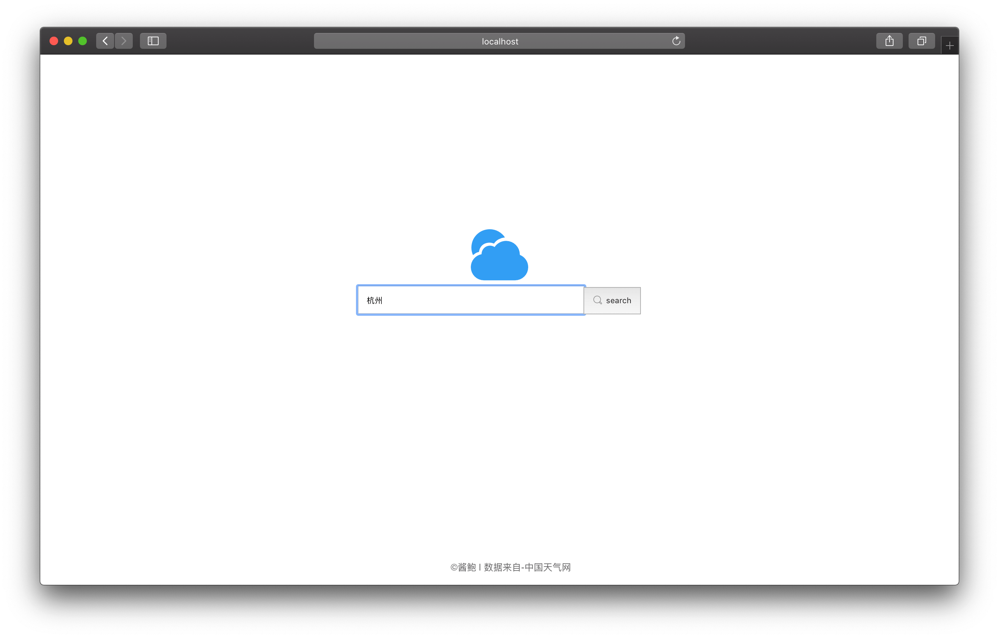

# weather-china
report weather restful server &amp; client practice

## result
<div align=center>
  
</div>
<div align=center>
    
</div>

## server
a restful server base on express
```
cd server & npm start
```
then the server listening at port 8888  
data from `http://www.weather.com.cn`

## koa-server
a restful server base on koa v2.x

## client
a web client, search weather client base on react
```
cd client & npm start
```
then the client listening at port 3000